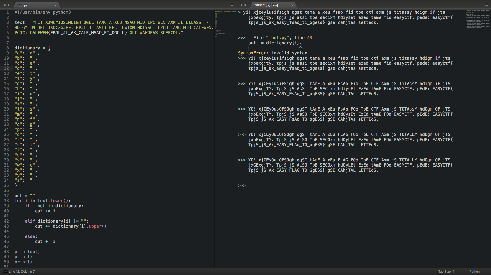

# Substitute - 50 points

Nobody can guess this flag! [msg.txt](../problem_files/msg.txt)

### Solution
###### Writeup by asinggih
###### credits to [Darren Chan]()

At the beginning, I had no idea what to do with the message! I thought it's a caesar cipher, but after bruteforcing the shift, I didn't see any combination that contains "easyctf" in it. I got stuck on this one, until [Darren Chan]() pointed out to actually remap the characters from the given message.

When we look at the message, we can see that the jumbled up text contains this pattern 

```
CALFWEN{EPJL_JL_AX_CALF_NSAO_EI_OGCLL}
```
From this message, there's a high possibility that ```CALFWEN``` can be decoded into ```EASYCTF```. Therefore, what we can do is to remap the charcater "C" into "E", "A" into "A", "L" into "S", and so on. I wrote a simple python program to help me remap the message. At the beginning, the corresponding value of the key is all empty, and i started populating the dictionary based on the ```EASYCTF```
pattern. Look at the given screenshot to see the progression in solving this problem.

```python
#!/usr/bin/env python3

def substitution(text):
	dictionary = {
	"a": "a" ,
	"b": "" ,
	"c": "e" ,
	"d": "r" ,
	"e": "t" ,
	"f": "y" ,
	"g": "u" ,
	"h": "p" ,
	"i": "o" ,
	"j": "i" ,
	"k": "" ,
	"l": "s" ,
	"m": "d" ,
	"n": "f" ,
	"o": "g" ,
	"p": "h" ,
	"q": "j" ,
	"r": "" ,
	"s": "l" ,
	"t": "m" ,
	"u": "w" ,
	"v": "" ,
	"w": "c" ,
	"x": "n" ,
	"y": "b" ,
	"z": "v" 
	}

	out = ""
	for i in text.lower():
		if i not in dictionary:		# if the character is not in the dictionary 
						# (punctuations or spaces)
			out += i

		elif dictionary[i] != "":	# if the the corresponding value of the key is not empty
			out += dictionary[i].upper() 	# replace it with the value, and change 
							# it to uppercase, so we know that it's 
							# already the correct character

		else:
			out += i 	# otherwise leave it as it is

	return out

if __name__ == '__main__':
	text = "FI! XJWCYIUSINLIGH QGLE TAMC A XCU NSAO NID EPC WEN AXM JL EIEASSF \
	HDIGM IN JEL JXOCXGJEF. EPJL JL ASLI EPC LCWIXM HDIYSCT CZCD TAMC NID CALFWEN. \
	PCDC: CALFWEN{EPJL_JL_AX_CALF_NSAO_EI_OGCLL} GLC WAHJEAS SCEECDL."

	print(substitution(text))
	print()
	print()

```

We can use the python program by slowly subtituting the characters by doing a loop through each of the given characters in the secret message, and use it as a key in our dictionary, which has the value of the "correct" alphabet characters. 

<p align="center"></p>

After remapping the required characters, we can see the flag in plaintext.

## Flag
>EASYCTF{THIS_IS_AN_EASY_FLAG_TO_GUESS}


