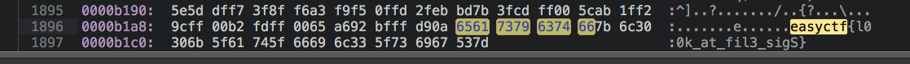

# Ezsteg - 30 points

There appears to be a message beyond what you can see in [soupculents.jpg](https://github.com/EasyCTF/easyctf-iv-problems/raw/master/ezsteg/soupculents.jpg)

hint: The description is a hint

### Solution
###### Writeup by asinggih

By looking at the title of the problem and the description, it can be said that this is a [steganography](https://en.wikipedia.org/wiki/Steganography) challenge. The first thing that i normally do when facing this kind of challenge is to see the corresponding hex/ascii value of the file. Because from my past experiences in CTFs, this is what they normally do. To do this, i utilised Sublime Text 3, with HexView plugin. After opening the file in hex mode, i searched for easyctf, and here's what i found:

## Flag
>easyctf{l00k_at_fil3_sigS}

