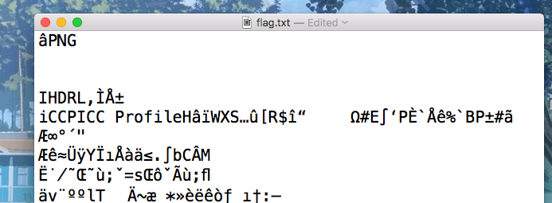
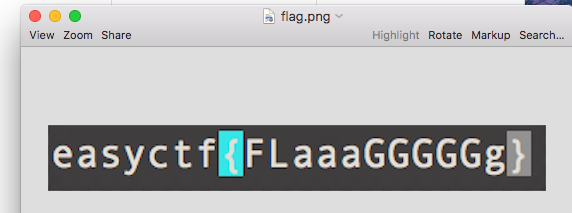

# Look at the flag - 30 points

What is the flag? [flag](https://github.com/EasyCTF/easyctf-iv-problems/raw/master/look_at_flag/flag.txt)

Hint: What is this file?

### Solution
###### Writeup by asinggih

After opening the downloaded file, it can be seen that this is supposed to be a .PNG file, by looking at the top of the file in a text editor.

Changing the file into the correct format gives us the flag below

## Flag
>easyctf{FLaaaGGGGGg}

