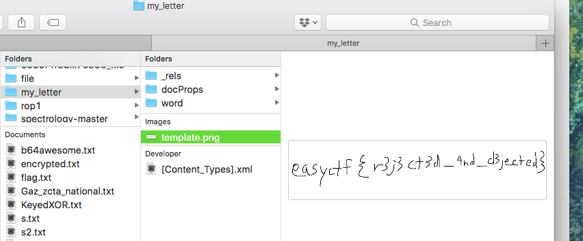

# My Letter - 80 points

I got a letter in my email the other day... It makes me feel sad, but maybe it'll make you glad. :( [file](https://github.com/EasyCTF/easyctf-iv-problems/raw/master/my_letter/myletter.docx)

Hint: The flag is not a rickroll

### Solution
###### Writeup by asinggih

This one took me some time to actually figure out the flag. Inside the word document, we can see bold and italicised characters.

Assembling these characters gave me "nevergonnagiveyouup". I doubted that it's the flag, since the hint says that the flag is not a rickroll. I was right, it was the wrong flag.

Hence i googled "Word document steganography". One of the results mentioned that a .docx document is actually a wrapper of several other files and folders. From this information, I decided to unarchive the .docx file, and it was right. it gave me several other folders. I examined each of them, and I found this:

## Flag
>easyctf{r3j3ct3d_4nd_d3jected}

