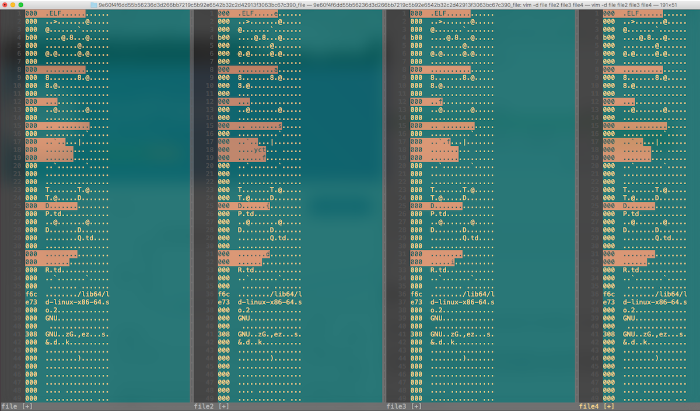

# Diff - 100 points

Sometimes, the differences matter. Especially between the files in [this archive](https://github.com/EasyCTF/easyctf-iv-problems/raw/master/diff/file.tar).

Hint: This is a [TAR](https://en.wikipedia.org/wiki/Tar_(computing)) archive file. You can extract the files inside this tar by navigating to the directory where you downloaded it and running `tar xf file.tar`! If you don't have `tar` on your personal computer, you could try doing it from the Shell server. Once you extract the files, try comparing the hex encodings of the files against the first file.


### Solution
###### Writeup by asinggih

This particular problem is pretty straightforward. The hint says that we should compare the hex encodings of the unarchived files against the first file. I'm sure there's better way to do this, but in my case, i utilised vim to solve it

So in terminal, type:

```sh
❯ vim -d file file2 file3 file4
```
-d option in vim enables the diff function

once we're inside vim, toggle the view of the file into its hex form by using

```vim
:%!xxd
```

after toggling all hex view in all files, this is what we have (orange highlights shows the differences between the files)
<p align="center"></p>

From the highlited contents of file2, it can be seen that we can obtain 

```
e,a,s,yct,f,{d 
```

Keep doing this until the end of file4, and assemble them. we will get

```
easyctf{diffinitly_an_ez_problem!}
```

## Flag
>easyctf{diffinitly_an_ez_problem!}


