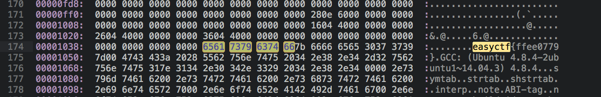

# Hexedit - 50 points

Can you find the flag in this [file](../problem_files/hexedit)?

### Solution
###### Writeup by asinggih

Just like what the title says, we need a hex editor to find the flag. Openning the file in the hex editor (I used Sublime Text 3 with HexView plugin) gives us both the hex and ascii view. From there, we just need to find ```easyctf``` pattern.

<p align="center"></p>

Note: We might get differnt values inside the ```easyctf{}``` since it's a randomly generated problem.

## Flag
>easyctf{ffee0779}


