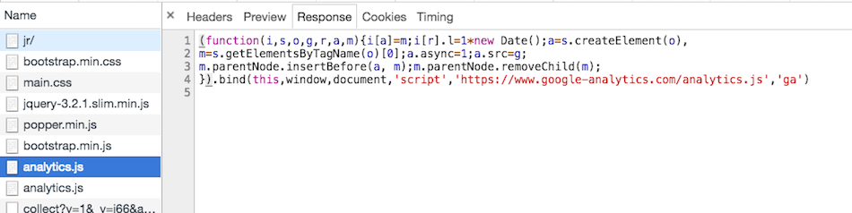

# Nosource,Jr. - 80 points

I don't like it when people try to view source on my page. Especially when
I put all this effort to put my flag verbatim into the source code, but
then people just look at the source to find the flag! How annoying.

This time, when I write my wonderful website, I'll have to hide my beautiful
flag to prevent you CTFers from stealing it, dagnabbit. We'll see what you're
[able to find](http://c1.easyctf.com:12486/jr/)...

Hint: Did you know that Chrome Developer Tools has a Network tab? 

### Solution
###### Writeup by asinggih

The first thing that I always do when doing a web challenge is to inspect the web page using chrome dev tools, and check its source code. Since I saw no flag at the html source code, i had to check the script section of the source. Below is the content of the script:

```js
  function process(a, b) {
    'use strict';
    var len = Math.max(a.length, b.length);		//find the bigger value between the two
    var out = [];
    for (var i = 0, ca, cb; i < len; i++) {			
      ca = a.charCodeAt(i % a.length);
      cb = b.charCodeAt(i % b.length);
      out.push(ca ^ cb);
    }
    return String.fromCharCode.apply(null, out);
  }

  (function (global) {
    'use strict';

    var formEl = document.getElementById('flag-form');
    var inputEl = document.getElementById('flag');
    var flag = 'Fg4GCRoHCQ4TFh0IBxENAE4qEgwHMBsfDiwJRQImHV8GQAwBDEYvV11BCA==';
    formEl.addEventListener('submit', function (e) {
      e.preventDefault();
      if (btoa(process(inputEl.value, global.encryptionKey)) === flag) {
        alert('Your flag is correct!');
      } else {
        alert('Incorrect, try again.');
      }
    });
  })(window);
```


By reading the code above, we can understand that:

- ```process(a, b)``` converts the input into an array of numbers by doing an XOR of the unicode value of characters in string a and unicode value of characters in string b (see the for loop section)

- In the ```global``` function, we can see that there's a variable called flag, which is in its base64 format (I know this from the typical ```==``` or ```=``` at the end of base64 encoded item).

	```js
	var flag = 'Fg4GCRoHCQ4TFh0IBxENAE4qEgwHMBsfDiwJRQImHV8GQAwBDEYvV11BCA==';
	```

- The base64 flag format was obtained by converting the output of ```process(a, b)```, which is a string, into a base64 format using the javascript's built in ```btoa```. 

- In our case, the arguments of ```process(a, b)``` are ```inputEl.value``` and ```global.encryptionKey```

	```js
	if (btoa(process(inputEl.value, global.encryptionKey)) === flag) {
	        alert('Your flag is correct!');
	```


- Now, the challenge is to determine the ```inputEl.value``` and ```global.encryptionKey```.  Need to be kept in mind that our final destination is ```inputEl.value```, since it is the the flag in the plain text format, before it was jumbled up using the code above. Hence, next step is to get the ```global.encryptionKey```.

Since the hint mentioned about the network tab on Chrome dev tools, I tried utilising its feature. Openning the network tab, and refreshing the webpage gave me several items. I double clicked each one of them, and actually found an interesting thing, hidden inside a google analytics script

```js
(function(i,s,o,g,r,a,m){i[a]=m;i[r].l=1*new Date();a=s.createElement(o),
m=s.getElementsByTagName(o)[0];a.async=1;a.src=g;
m.parentNode.insertBefore(a, m);m.parentNode.removeChild(m);
}).bind(this,window,document,'script','https://www.google-analytics.com/analytics.js','ga')
('encryptionKey', 'soupy')
```

From the snippet, it can be seen that the encryption key might be ```soupy```. I was quite confident that I was on the right track due to the fact that they added so much space before ```('encryptionKey', 'soupy')```, so that it prevented us to see it on the preview of the script.

<p align="center"></p>

Now that we have the encryption key, our next step is to reverse engineer the whole process so that we can obtain the flag in the plain text format. In order to do this, I rewrote the encryption function in python, as well as the decoder

```python
#!/usr/bin/env python3

import base64

def stringToBase64(s):
    return base64.b64encode(s.encode('utf-8'))

def base64ToString(b):
    return base64.b64decode(b).decode('utf-8')


#---------------------------------------------------------

#	 Translated function from the given javascript 

#---------------------------------------------------------

def process(a,b):
	length = max(len(a), len(b))
	out = []
	for i in range(length):
		ca = ord(a[i % len(a)])
		cb = ord(b[i % len(b)])

		out.append(ca ^ cb)

	finalString = "" 						
	for i in out:
		finalString += (chr(i))
	return stringToBase64(finalString)		# returns the same value as 
							#btoa(process(inputEl.value, global.encryptionKey)

#-----------------------------------------------------------

def superdecoder(s):
	b = "soupy"
	finalString = base64ToString(s)		# this is the first step, converting  b64 format to string

	length = 43			#  This will be the range of the loop.
					#  I got this number by slowly incrementing the length of 
					#  a plaintext in process(plaintext, encryptionKey) that has 
					#  the same encoded length as the jumbled up flag that we have.
									

	out = []
	for i in finalString:
		out.append(ord(i))

	result = []					# This array will contain ca
	for j in range(length):
		ca = out[j] ^ ord(b[j % len(b)])
		result.append(ca)


	final = ""
	for x in result:			# need to extract a from the array containing ca
		final += chr(x)
	return final


if __name__ == '__main__':
	flag = b'Fg4GCRoHCQ4TFh0IBxENAE4qEgwHMBsfDiwJRQImHV8GQAwBDEYvV11BCA=='
	key = "soupy"
	
	test = "easyctf{Hello_how_are_you_test_test_length}"
	x = process(test, key)		# for length testing purposes

	y = superdecoder(flag)
	print(y)
```

After running the python code above, we will obtain the ```inputEl.value```, which is our
flag in the plaintext form.

```sh
❯ ./nosource.py       
easyctf{congrats!_but_now_f0r_n0s0urc3_...}
```

## Flag
>easyctf{congrats!_but_now_f0r_n0s0urc3_...}
